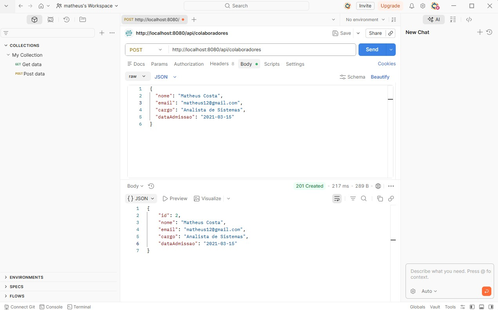
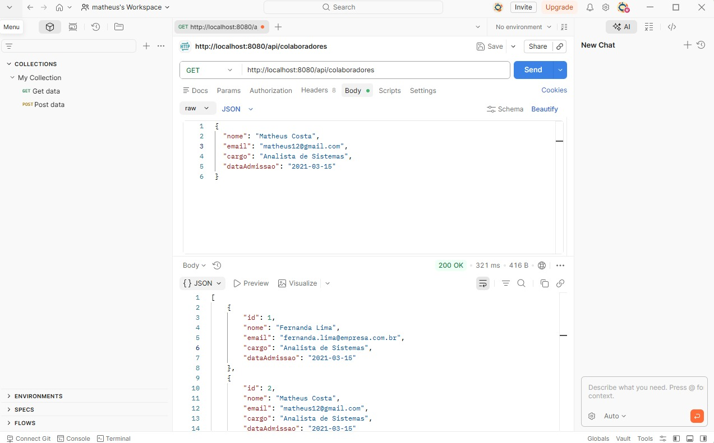
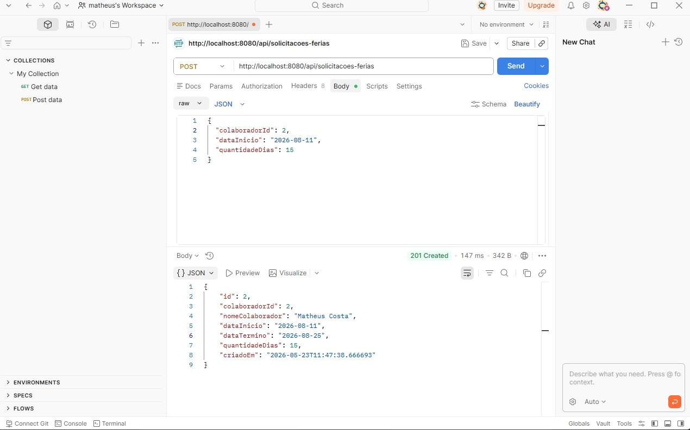
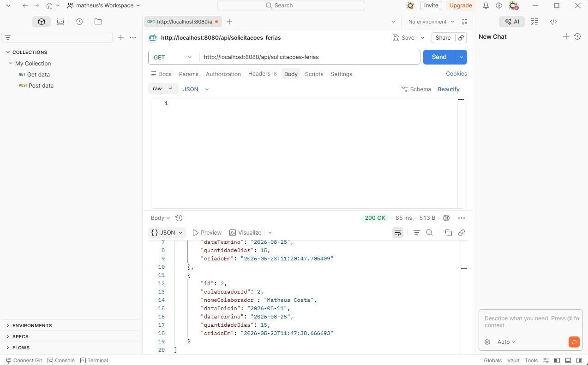
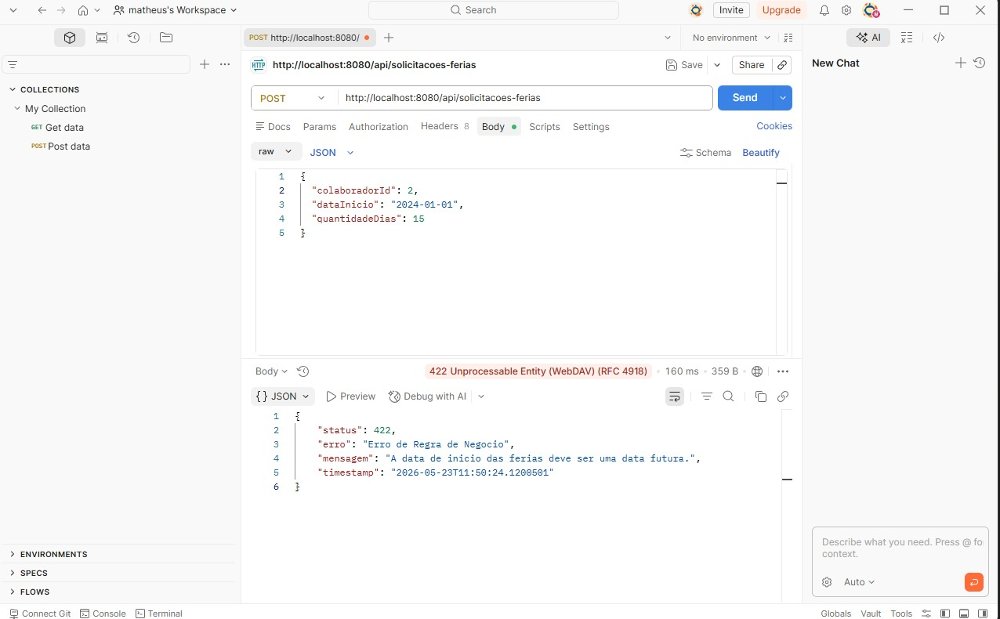
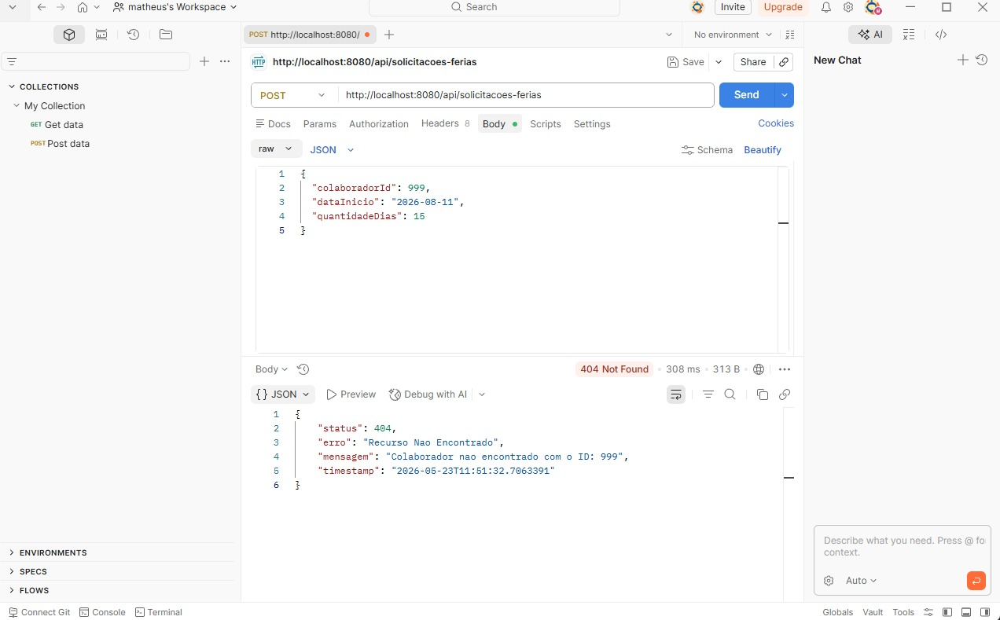
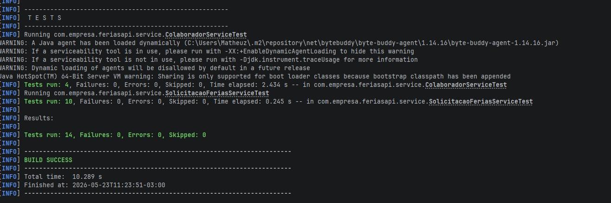

<div align="center">

<h1>API de Controle e Agendamento de Férias Corporativas</h1>
<h3><em>Corporate Vacation Scheduling and Control API</em></h3>


</div>

---

## Sumário / Table of Contents

- [Visão Geral / Overview](#visão-geral--overview)
- [Stack](#stack)
- [Como Executar / How to Run](#como-executar--how-to-run)
- [Documentação dos Endpoints / Endpoint Documentation](#documentação-dos-endpoints--endpoint-documentation)
- [Validações e Erros / Validations and Errors](#validações-e-erros--validations-and-errors)
- [Testes Unitários / Unit Tests](#testes-unitários--unit-tests)
- [Estrutura do Projeto / Project Structure](#estrutura-do-projeto--project-structure)

---

## Visão Geral / Overview

**PT-BR** — Esta API resolve o problema de gestão descentralizada de férias em ambientes corporativos. Sem um sistema dedicado, solicitações de férias ficam dispersas em e-mails e planilhas, tornando impossível identificar conflitos de período, auditar o histórico de aprovações ou garantir que as solicitações respeitam as políticas internas da empresa. A API centraliza o ciclo de vida das solicitações: desde o cadastro do colaborador até a criação e listagem de pedidos de férias, aplicando as regras de negócio de forma automática e retornando erros estruturados e legíveis.

**EN** — This API solves the problem of decentralized vacation management in corporate environments. Without a dedicated system, vacation requests end up scattered across emails and spreadsheets, making it impossible to detect scheduling conflicts, audit approval history, or ensure compliance with company policies. The API centralizes the request lifecycle — from employee registration to vacation request creation and listing — enforcing business rules automatically and returning structured, readable error responses.

---

## Stack

| Tecnologia / Technology | Versão / Version |
|---|---|
| Java | 21 |
| Spring Boot | 3.3 |
| Spring Data JPA / Hibernate | 6.5 |
| PostgreSQL | 16 |
| JUnit 5 + Mockito | — |
| Docker Compose | — |

---

## Como Executar / How to Run

**PT-BR**

### Pré-requisitos

- Docker e Docker Compose instalados e em execução
- JDK 21 instalado
- Maven 3.9+ instalado

### Passo 1 — Subir o banco de dados

Na raiz do projeto, execute:

```bash
docker-compose up -d
```

Isso sobe um container PostgreSQL na porta `5432` com as credenciais pré-configuradas.

### Passo 2 — Executar a aplicação

```bash
./mvnw spring-boot:run
```

A aplicação estará disponível em `http://localhost:8080`.

---

**EN**

### Prerequisites

- Docker and Docker Compose installed and running
- JDK 21 installed
- Maven 3.9+ installed

### Step 1 — Start the database

At the project root, run:

```bash
docker-compose up -d
```

This starts a PostgreSQL container on port `5432` with pre-configured credentials.

### Step 2 — Run the application

```bash
./mvnw spring-boot:run
```

The application will be available at `http://localhost:8080`.

---

## Documentação dos Endpoints / Endpoint Documentation

> Recomenda-se o uso do **Postman** ou **Insomnia** para testar os endpoints.
> Using **Postman** or **Insomnia** is recommended for endpoint testing.

---

### POST `/api/colaboradores` — Cadastrar Colaborador / Register Employee

**PT-BR** — Cria um novo colaborador no sistema.
**EN** — Creates a new employee in the system.

**Request Body:**
```json
{
  "nome": "Fernanda Lima",
  "email": "fernanda.lima@empresa.com.br",
  "cargo": "Analista de Sistemas",
  "dataAdmissao": "2021-03-15"
}
```

**Response `201 Created`:**
```json
{
  "id": 1,
  "nome": "Fernanda Lima",
  "email": "fernanda.lima@empresa.com.br",
  "cargo": "Analista de Sistemas",
  "dataAdmissao": "2021-03-15"
}
```



---

### GET `/api/colaboradores` — Listar Colaboradores / List Employees

**PT-BR** — Retorna todos os colaboradores cadastrados.
**EN** — Returns all registered employees.

**Response `200 OK`:**
```json
[
  {
    "id": 1,
    "nome": "Fernanda Lima",
    "email": "fernanda.lima@empresa.com.br",
    "cargo": "Analista de Sistemas",
    "dataAdmissao": "2021-03-15"
  }
]
```



---

### POST `/api/solicitacoes-ferias` — Criar Solicitação / Create Vacation Request

**PT-BR** — Registra uma solicitação de férias vinculada a um colaborador existente.
**EN** — Registers a vacation request linked to an existing employee.

**Regras de negócio / Business rules:**
- `dataInicio` deve ser uma data futura / must be a future date
- `quantidadeDias` deve estar entre 5 e 30 / must be between 5 and 30

**Request Body:**
```json
{
  "colaboradorId": 1,
  "dataInicio": "2026-08-11",
  "quantidadeDias": 15
}
```

**Response `201 Created`:**
```json
{
  "id": 1,
  "colaboradorId": 1,
  "nomeColaborador": "Fernanda Lima",
  "dataInicio": "2026-08-11",
  "dataTermino": "2026-08-25",
  "quantidadeDias": 15,
  "criadoEm": "2026-05-22T16:30:00"
}
```



---

### GET `/api/solicitacoes-ferias` — Listar Solicitações / List Vacation Requests

**PT-BR** — Retorna todas as solicitações de férias registradas.
**EN** — Returns all registered vacation requests.

**Response `200 OK`:**
```json
[
  {
    "id": 1,
    "colaboradorId": 1,
    "nomeColaborador": "Fernanda Lima",
    "dataInicio": "2026-08-11",
    "dataTermino": "2026-08-25",
    "quantidadeDias": 15,
    "criadoEm": "2026-05-22T16:30:00"
  }
]
```



---

## Validações e Erros / Validations and Errors

**PT-BR** — Todos os erros retornam um JSON estruturado sem expor o stack trace.
**EN** — All errors return a structured JSON without exposing the stack trace.

**Estrutura padrão / Standard error structure:**
```json
{
  "status": 422,
  "erro": "Erro de Regra de Negocio",
  "mensagem": "A data de inicio das ferias deve ser uma data futura.",
  "timestamp": "2026-05-22T16:35:00"
}
```

### Cenários de erro / Error scenarios

| Status | PT-BR | EN |
|---|---|---|
| `400 Bad Request` | Campos obrigatórios ausentes ou formato inválido | Missing required fields or invalid format |
| `404 Not Found` | Colaborador não encontrado pelo ID informado | Employee not found for the given ID |
| `422 Unprocessable Entity` | Data de início no passado; dias fora do intervalo 5-30; e-mail duplicado | Past start date; days outside 5-30 range; duplicate email |





---

## Testes Unitários / Unit Tests

**PT-BR** — Execute os testes com o comando abaixo. Os 13 casos cobrem cenários de sucesso, limites exatos de validação e todas as exceções esperadas.

**EN** — Run the tests with the command below. The 13 cases cover success scenarios, exact validation boundaries, and all expected exceptions.

```bash
./mvnw test
```

**Saída esperada / Expected output:**

```
[INFO] Tests run: 13, Failures: 0, Errors: 0, Skipped: 0
[INFO] BUILD SUCCESS
```



---

## Estrutura do Projeto / Project Structure

```
ferias-api/
├── docker-compose.yml
├── pom.xml
├── docs/                          ← prints de demonstração / demo screenshots
│   ├── p1.jpeg
│   ├── p2.jpeg
│   └── ...
└── src/
    ├── main/
    │   ├── java/com/empresa/feriasapi/
    │   │   ├── controller/        ← endpoints REST
    │   │   ├── service/           ← regras de negócio / business logic
    │   │   ├── repository/        ← interfaces JPA
    │   │   ├── model/             ← entidades JPA / JPA entities
    │   │   ├── dto/               ← objetos de transferência / transfer objects
    │   │   └── exception/         ← exceções e handler global / exceptions and global handler
    │   └── resources/
    │       └── application.properties
    └── test/
        └── java/com/empresa/feriasapi/
            └── service/           ← testes unitários / unit tests
```

---

<div align="center">
Desenvolvido por / Developed by <strong>Matheus</strong>
</div>